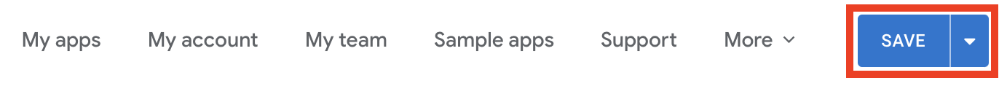
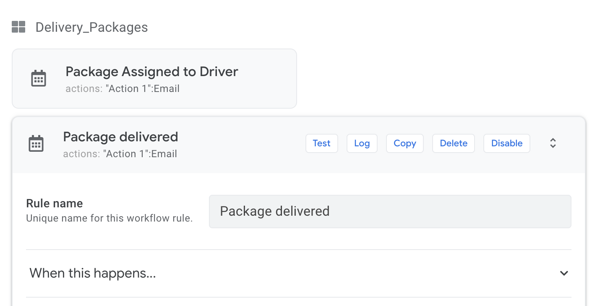

## My first app with Appsheet

Hello world! During this lab we will explore how to create our first Appsheet app and the different features the platform offers. Keep in mind that the intention of this lab is to give a high overview of the solution and help you initiate into the citizen developer's world! Let's start!


## Pre-requisites: 
1) A Google Account

## Login into Appsheet
1. Login into http://appsheet.com
1. Click on Login and Select Google as your best way to sign in.

1. Select the Google Account you would like to use for this Lab
1. Allow permissuons to access Google resources on it's behalf. After this lab you can revoke these permissions if needed. Click allow.
1. In this screen you will see different settings of your account. From allowed sources you have added to integration with third party auth, data stores or Channels, to billing information.

## Create an app
1. Do click under My Apps. An overlay frame will allow you to choose between "Start with your data", "Start with an idea" or "Start with a sample app". During this short lab, we will explore a sample app. Click "Start with a sample app".

ç1. Select a name for your app. In this case we will use  ```AppsheetLab1```. Under categories, select Logistics. Select *Shipment Tracking* as the sample app to deploy.
1. Waiting until the new app is set up.
1. Close the pop-up informational help tool.

## Exploring the Appsheet interface

Appsheet divides its interface in 4 main locations:

1. Top bar menu: Here we can go back to the main Appsheet webpage, review our team's work, explore more sample apps, connect with support and go into settings for our own account.
1. Left navigation bar: We will explore this bar during the lab. It has information about the data we are connecting with, the interfaces we will use in our app, workgflows and behaviors, security settings or special features like intelligence. Also we can manage access to our apps and further settigns of our current application.
1. Right live preview app: Every change we make in the app will be reflected in this fully functional app in the right. If we make a change in the interface, the change will be automatically reflected in the preview so we can continuesly acknlogede all the changes we might want to do.
1. Main panel: Here is where we will perform most of the changes once we select the different options of in the left navigation bar.

## Exploring the source of data.
### Tables and Columns

Tables are comprised of columns, which identify the different components of each record. A record is a row of data in your spreadsheet. For instance, a table of addresses would have a column each for street number, street name, city, state, and zip code. Rows contain the data for each individual piece. For the address example, each address would have its own row.


1. Under the Left navigation bar, click under Data.

We now see 4 different Table: Users, Vendors, Building_Sites and Delivery_Packages. Click on Users.

1. Under the different tabs, we can see Storage, Security, Scale, Localization and Documentation. 
- The first one, Storage, gives us information about the source of the data, in this case, Google Sheets. 
- The second one, Security, gives us Security measures to prevent information to be shown in the application or restict visibility of the table depending of the role of the user accessing the app.
- The third one, Scale, gives us the possiblity of source the data under different worksheets (with Business Plan).
- Localization, the forth one, identifies the locale or langague the worksheet is. This will help autodetecting fields and columns.
- Documentation, the last one, let's you comment this table for other collaborators to better align with the content of the same.

2. Click in *View Source*. This will open a new tab in your browser with the worksheet you are using as the main data source of your application. Explore the different tabs and fields to see the different intents of the application.

1. Go back to Appsheet and, just besides *View Source*, click on View Columns. This will the main panel with information about the Columns and how did Appsheet interpretated the worksheet fields. If we click on each of the edit icons of each field, we open a contextual menu with more information to change about these fields. In this example click on the edit button of *User_Name*. 
1.We want to change the display name of this field. For that, we will scroll to the Display bar and click to open the menu. Let's change the display name of this field to ```Name```. Click on the text box and the *Expression Assistant* will open. Get familiarized with this Expression Assistant since it is a poweful tool to create conditions, expressions, deep links and auto-generate values in many of the contexts of Appsheet. Write ```Name``` in the text box. Click Save and then Done.

1. To see the changes reflected on our preview application we need to save the application. Click on the Save button, top right corner of the Top bar menu.

1. Now, in the application, click in the menu to display the different data sources added to the app. The click on ```Users```. 


    Select one of the users by clicking on it. As you can see, the Name field has a display customization. 

    
1. One last thing to notice in this brief lab, is the reference columns. In this case, the last 3 of this table: *Related Building_Sites*, *Related Delivery_Packages* and *Related Building_Sites By Site_Contact*. These 3 fields are a relation between tables. If we click on the Foruma text field, the *Expression Assistant* will show up and we can see how to reference columns to other rows in different tables. In this case, the vale of *Site_Admin* must be equal to *UserId*, which is a **Key** field in this Table.

Take quick look at the table *Delivery_Packages* as we did for *Users*. Review its columns as well. Notice the different Formulas and the Show field where we decide if we show the field based out of the content of the same.

### Slices

When you show the contents of a table in your app, you do not need to show every row, every column, and every action. Instead, you can "slice" the data, choosing a subset of the columns, actions, and rows. A slice is a subset of the rows, columns, and actions of a table.

1. Go to the *Slices* menu under In this case, select *Delivered*. Notice that this slice has a condition: ```[Package_Status]=Delivered```. This condition provides a row filter (show/not show). Ig the *Package_Status* has the value *Delivered*, then the row will be show in the slice. If not, the row will be hide.
1. Under *Slice Columns*, we can select all the columns or just select those columns that we want to show in this slice. You can remove *Package_Driver* by clicking the trash bin icon at the right of this column. 
1. Within the app, click on *Overview*. Scroll down until Delivered and select one of the delivered packages.

    

    You should be able to see that all the *Package_Driver* is not present any more. Test a few fields and, at any time, if you want to recover the fields into the slice, click under the + button. 

    

## Exploring views

Let's focus now on views. Views allow you to control how, when, and where data is presented to the app user, and how the user interacts with the data. For that, click on UX under the Navigation bar. Under View's tab, we have 3 different options, Create views, Primary views and Menu views. We an also search for specific views (really handy when we have rich and poweful apps).
    
1. Let's click on the *Drivers* Primary view. 
1. Now, in the app preview section, click the Drivers icon to see real time changes in the app.
1. We are going to change the view type from *Table* to *Gallery*.

    
1. In this view, we are showing pictures and names of the *Delivery_Packages*. This is not useful when searching by Drivers so, under *For this data*, change it *Users*. The changes should reflect inmidiatly. 

    

1. Finally, one last change before we move on. Let's sort the list by *User_Name*. T odo this, under View Options, click *Add* and select User_Name as the sorting option.

    

## Exploring Behavior

### Actions

By default, standard behaviors are automatically applied to every app based on the structure of the data (tables and slices). As the app creator, you can change and augment these standard behaviors. The Behavior tab of the editor is the place to make these changes.

The primary behavioral concept is an action. An action is an operation that changes the state of the app. Some of the actions are automatically defined by the system (system-defined) and can be modified by you, the app creator. You can also explicitly create new actions.

For this lab, we will explore one of the current actions.

1. On the Left Navigation bar, click on Behavior. This will show the current actions assigned in the sample app.
    
    
1. For the sake of simplicity, we will review Delivery_Time. Click on that behavior to see the implementation.

    

    The important piece is to understand the flow of a behavior: "For a record of a table, do this by setting these columns". In this case:
    
    1.  For *Delivery_Packages* table, *set the values of some columns in this row*, these columns being *Delivery_Time* with the value *NOW()*. In other words, whenever we dropoff a package, we set the delivery time to the current time.

        

Try yourself to drop off a package and see how the field changes.

Feel free to explore more complex actions in this example or even create/update to test the flow in the app preview.

### Workflows

It is important to trigger certain actions whenever something happens that might need to go outside of the application. For example, send an email to the customer once the package has been delivered or send a webhook to a certain external app that would trigger a business complex workflow in another system. You can do this easily with worflows.

At the top bar, select *Workflow* and then *Delivery_Packages*.
    


Let's explore what happens here when a package is assigned to a driver.


1. Click on the section *When this happens...*: Based on a target data (Delivery_Packages), on an add only action.
1. Click on the section *If this is true*: Only if the added data fits this condition:
    ```
    AND([_thisrow_before].[Package_Driver] <> [_thisrow_after].[Package_Driver],ISNOTBLANK([Package_Driver]),[Package_Status]="Assigned")
    ```
    Basically, if we assigned a package to a driver (not blank) and it's different from a previously assigned driver.
1. Click on the section *Do this*: We send an email to the package driver.

## Deploy your app

Now it's time to see your app in action! For that, on the Left navigation bar, click on *Not Deployed*. You will see a bunch of warnings that should be addressed before deploying the app. For simplicity, we will go ahead and deploy by clicking on *Move app to deployed state despite errors*.


Congratulations! Your app has been deployed! To see a link to access your app, click on Users > Links. Copy the Browser link and access your app!


## Wrap up

You have successfully created your first Appsheet app. Feel free to explore other examples or create your own based on your data. Here is a page to Appsheet documentation to see all the features and capabilities of the platform.
- https://www.appsheet.com/support
- https://help.appsheet.com/en/

Become a **Citizen developer**!